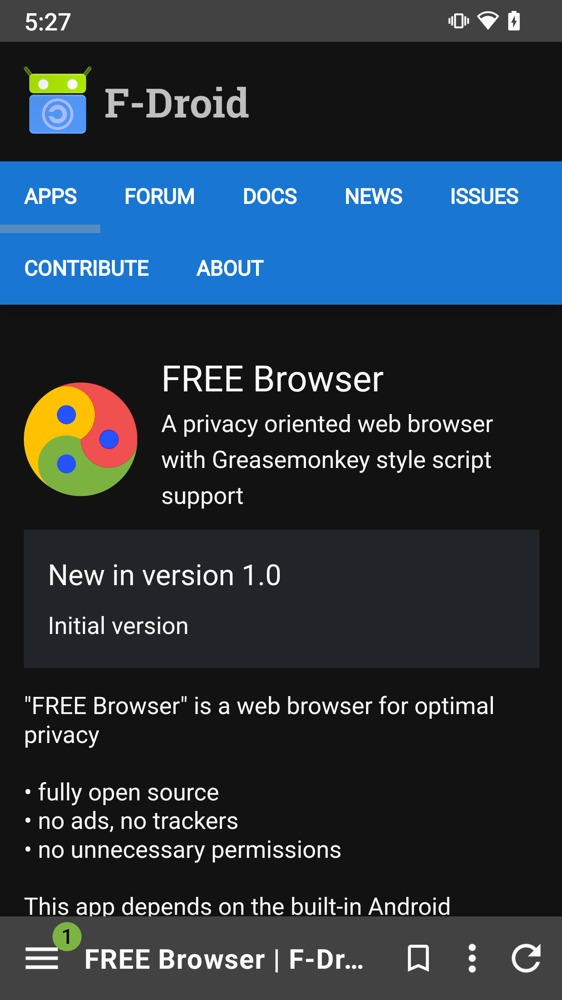
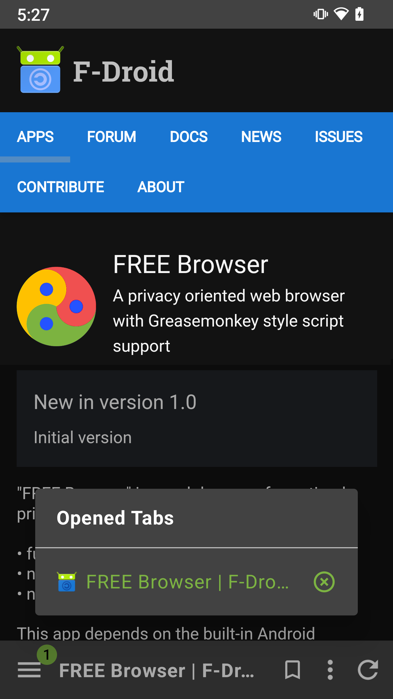
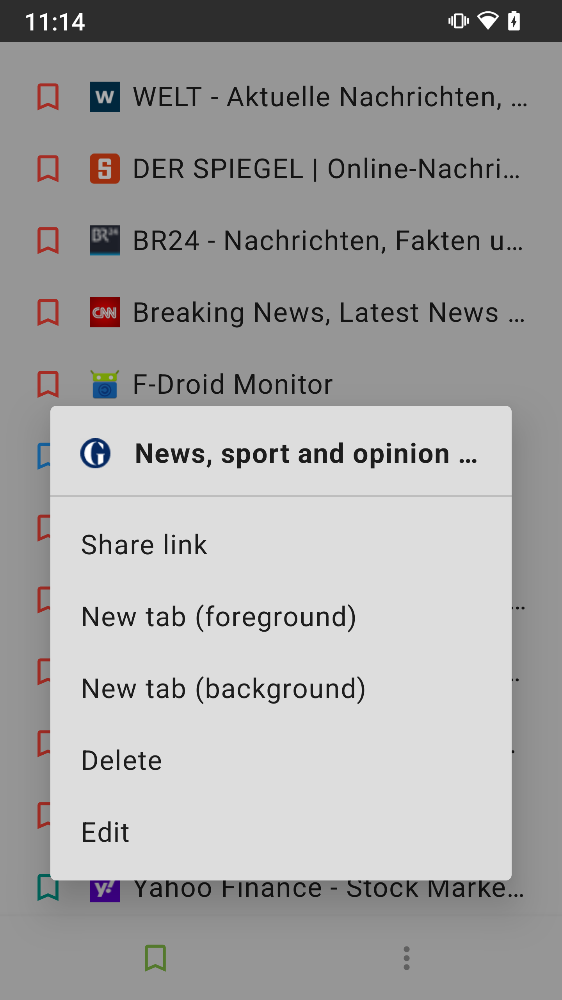
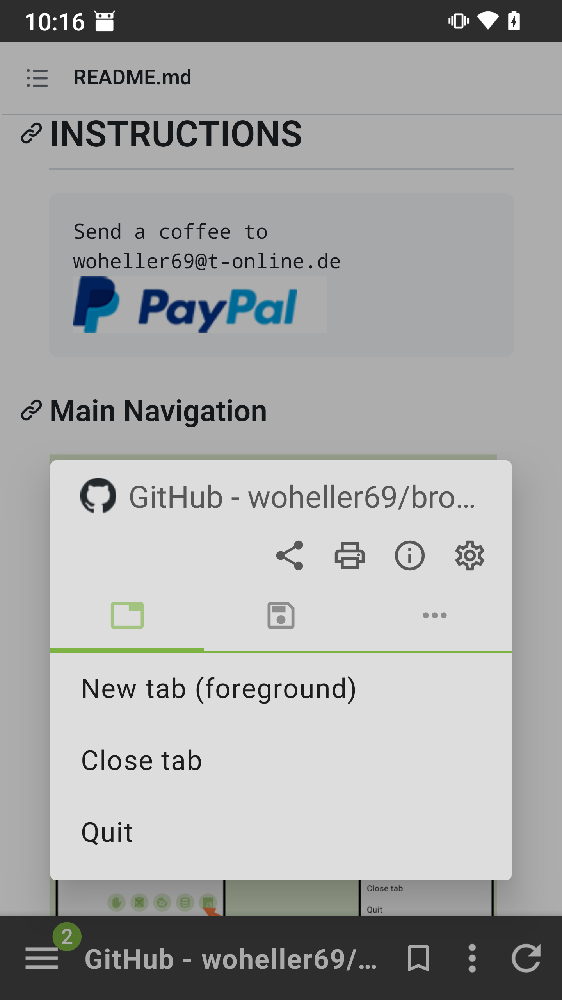
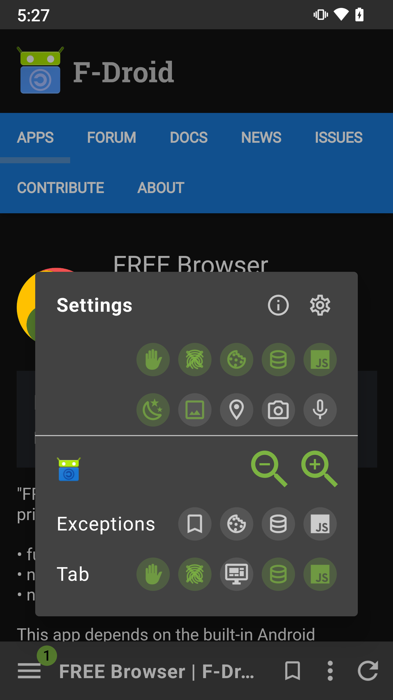
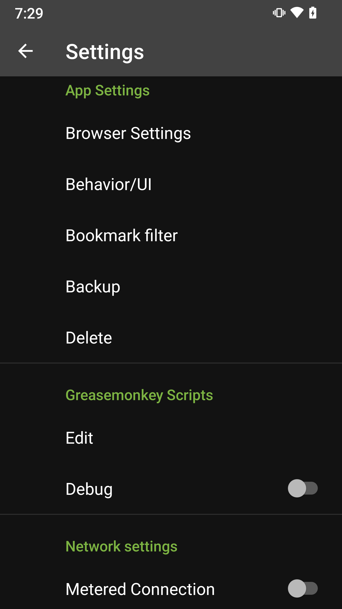
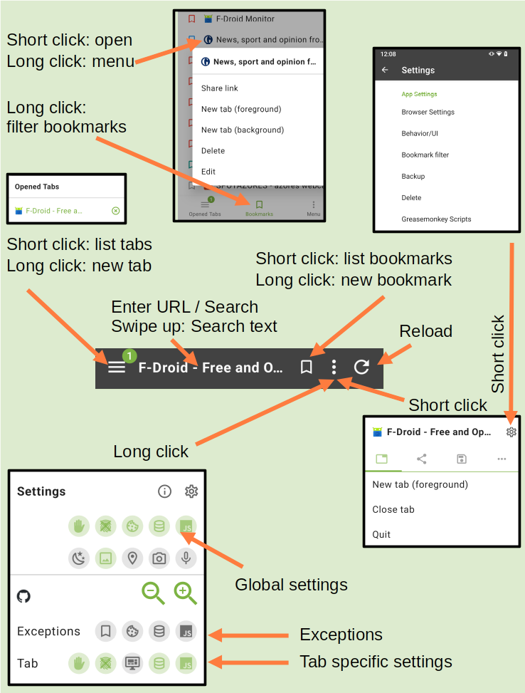
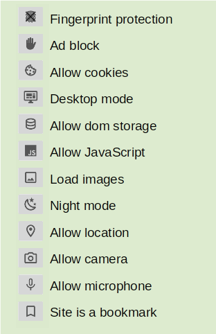

# FREE Browser

    

  


FREE Browser is a web browser for optimal privacy

- fully open source
- no trackers
- no unnecessary permissions


## FEATURES

- AdBlocker using [StevenBlack host list](https://github.com/StevenBlack/hosts)
- Measures against browser fingerprinting
- Cookie Banner Blocker: Auto "Deny", based on [Cookie Banner Rules for Firefox](https://github.com/mozilla/cookie-banner-rules-list)
- Advanced settings for javascript, cookies and DOM-storage (domain/bookmark based)
- Support for Greasemonkey style scripts
- Optimized for one hand handling (toolbar at bottom)
- TAB control (switch, open, close, unlimited tabs)
- Fast toggle for most important settings
- Search current website
- Web search (from marked text via context menu)
- Save as PDF
- Open links in other apps (for example YouTube)
- Backup
- etc


## LICENSE

This app is licensed under the GPLv3.

The app uses code from:
- FOSS-Browser, https://codeberg.org/Gaukler_Faun/FOSS_Browser, published under GPLv3 (at time of fork)
- Ninja, https://github.com/mthli/Ninja, published under Apache-2.0 license
- Zip4j, https://github.com/srikanth-lingala/zip4j, published under Apache-2.0 license
- StevenBlack hosts, https://github.com/StevenBlack/hosts, published under MIT license
- DuckDuckGo Android browser: https://github.com/duckduckgo/Android, published under Apache-2.0 license

The app supports (not included, will be downloaded if switched on):
- Mozilla Firefox Cookie Banner Rules, https://github.com/mozilla/cookie-banner-rules-list, published under MPL-2.0 license

## INSTRUCTIONS


### Main Navigation
 

The main navigation features are depicted in the image above.

For each tab it is possible to enable/disable:
- AdBlock
- Anti-Browser-Fingerprinting measures
- Desktop Mode
- DOM-Storage
- JavaScript

These settings (except desktop mode) are inherited from global settings when a new tab is created.
They will always be applied when a new web site is opened.

FREE Browser allows bookmark specific settings for JavaScript, DOM-Storage, and Desktop mode. These are set from the current
tab when storing the bookmark and can be changed when editing it.
If a bookmark is opened these settings will be applied, no matter which other settings are valid for the tab.
If this is the case the bookmark symbol in "Exceptions" will be highlighted. When browsing within the domain of the
bookmark these settings will remain. 

In addition you can define domains where Cookies, DOM-Storage, and JavaScript are always allowed (see Settings -> Browser Settings).
Cookies will override the global cookies setting. DOM-Storage and JavaScript will override the tab specific settings.
If one of these exceptions is active the respective icon will also be highlighted in "Exceptions". 
A click on the icon will add/remove an exception. Third party cookies are only supported if cookies are enabled AND fingerprint protection is switched off.

In additions there are settings which are only available as global settings and apply to all websites:
- Allow location access: enables websites to access your device's location
- Allow camera access: allows websites to use your device's camera
- Allow microphone access: allows websites to use your device's microphone
- Download images: saves data by downloading images only when not connected to a metered network, usually a WiFi connection; otherwise, images will always be loaded when connected to a non-metered network
- Night mode: enables algorithmic darkening of web pages when the app is in dark mode and the website doesn't have a dark version

### Cookie Banner Blocker

FREE Browser comes equipped with integrated support for Mozilla's [Cookie Banner Rules](https://github.com/mozilla/cookie-banner-rules-list). 
This feature allows the browser to automatically inject cookies that opt out of any unnecessary cookies, while also attempting to click opt out if a banner is present. 
However, please note that this functionality is only available for banners that are not located within child windows (```runContext: 'child'```, used by very few rules only). 
If you notice any missing rules, please open an issue in Mozilla's repository after trying with Firefox first.
Important: Cookie Banner Blocker requires JavaScript! 

### Greasemonkey style scripts

FREE Browser supports simple user scripts in Greasemonkey style.
(e.g. [Github Old Feed](https://github.com/wangrongding/github-old-feed/) )
The following tags:
- @match (required!)
- @run-at
- @name

@run-at:  
If defined as "document-start" scripts run in onPageStarted() of Android WebView, 
otherwise scripts run in onPageFinished.

@match: At least one tag required. E.g. ```@match https://*/``` to match all https urls  
If the expression after @match starts and ends with "/" it is treated as a regex.

Other tags are **NOT** supported at the moment, e.g.
- @include
- @exclude
- @grant
- @required

### Browser Settings

In this section you can define your favourite start page, search engine, etc.
You can select your favourite StevenBlack AdBlock list. You can also enter list of additional domains (one domain per line) which should be blocked.
And this is the place to manage exceptions for cookies, javascript, and DOM storage.


### Backup / restore

You can save / restore app data (=databases), bookmarks, and preferences.
Data will be stored in Documents/browser_backup.

